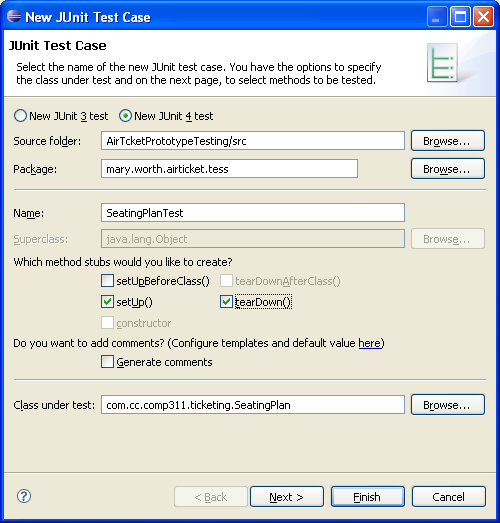
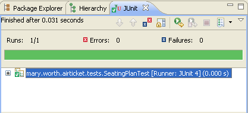

# COMP311: Unit Testing with JUnit

[](https://codespaces.new/ttran375/comp311-lab6)

## Question 5

5. Create a JUnit test case to verify that the constructor of the `SeatingPlan` class generates the required seating plan by following the steps below.

For this assignment, put all test classes into one package and include your name in the package name. For example, **mary.worth.airticket.tests**.

a. Right-click on the **AirTicketPrototypeTesting** project, select **New** → **JUnit Test Case**.

   i. Be sure to select the **New JUnit 4 test** radio button.

   ii. Enter the package name ***your.name*.airticket.tests**.

   iii. Enter the class name **SeatingPlanTest**.

   iv. Check the boxes to create stubs for **setUp()** and **tearDown()**.

   v. Specify that the class under test is **SeatingPlanTest**.

   vi. Click **Next**.

   

   vii. When you see a list of test methods, select to generate tasks for the constructor **SeatingPlan()** only. Click **Finish**.

   viii. A dialog asks if you want to add Junit 4 to the project build path. Click **OK**. Because JUnit is built into Eclipse, this is all the setup required to build and run test cases.

b. The tool generates a skeleton test class with annotated methods for you.

   Complete the methods:

   i. Insert code into the `setUp()` method to write the message "Starting test of the SeatingPlan default constructor" to the console.

   ii. Insert code into the `tearDown()` method to write the message "Test of the SeatingPlan default constructor complete" to the console.

   iii. Modify the `testSeatingPlan()` method to create an instance of `SeatingPlan` and verify that the new object is constructed as expected. Consider how to express the test using methods of the `org.junit.Assert` class. For example, the `SeatingPlan` instance must not be null. Its `getSeats()` method should return an `ArrayList` of size 14, and its `getSeatReserver()` method should return a non-null object reference.

Just for this first test, solution code is provided here.

```java
package com.cc.airline.ticketing;

import static org.junit.Assert.*;

import org.junit.After;
import org.junit.AfterClass;
import org.junit.Before;
import org.junit.BeforeClass;
import org.junit.Test;

public class SeatingPlanTest {

    @BeforeClass
    public static void setUpBeforeClass() throws Exception {
        System.out.println("Starting test of the SeatingPlan default constructor:setUpBeforeClass()");
    }

    @AfterClass
    public static void tearDownAfterClass() throws Exception {
        System.out.println("Starting test of the SeatingPlan default constructor:setUpBeforeClass():tearDownAfterClass()");
    }

    @Before
    public void setUp() throws Exception {
        System.out.println("Starting test of the SeatingPlan default constructor:setUpBeforeClass():setUp()");
    }

    @After
    public void tearDown() throws Exception {
        System.out.println("Starting test of the SeatingPlan default constructor:setUpBeforeClass():tearDown()");
    }

    @Test
    public void testSeatingPlan() {
        SeatingPlan sp = new SeatingPlan();

        int actualNumBusSeats = sp.getNumBusSeats();
        int actualNumTotalRows = sp.getTotalRows();
        int actualNumTotalSeats = sp.getTotalSeats();

        int expectedNumBusSeats = 2;
        int expectedNumTotalRows = 4;
        int expectedNumTotalSeats = 14;

        assertEquals(expectedNumBusSeats, actualNumBusSeats);
        assertEquals(expectedNumTotalRows, actualNumTotalRows);
        assertEquals(expectedNumTotalSeats, actualNumTotalSeats);
    }
}
```

c. Run the test and verify that it is successful.

   i. In the Package Explorer, right-click the **SeatingPlanTest** class and select **Run As** → **JUnit test**.

   ii. The Console view opens and displays the following messages:

    Starting test of the SeatingPlan default constructor
    Seating plan has 14 seats.
    Test of the SeatingPlan default constructor complete

   iii. Verify that the JUnit view shows that the test ran successfully.

   

## Question 6

6. Create a second test class called `TicketTest` to test that a `Ticket` object is constructed correctly when provided reasonable input.

a. Write a test method that calls the following constructor with valid arguments: `Ticket(Passenger p, Seat s, double price)`

   Before you create the `Ticket` object:

   i. Use the wizard to generate the `TicketTest` class.

   ii. Add a test method to the class.

   iii. In the test method, create a `Passenger` object. The default constructor of the `Passenger` class generates a valid name "T. B. A.", so *either* of the following statements instantiate a `Passenger`:

   ```java
   Passenger passenger = new Passenger();
   ```

   Or:

   ```java
   Passenger passenger = new Passenger(new PassengerName("Mary", "I", "Worth"));
   ```

   iv. Create a `Seat` object.

   The `Seat` class has no explicit constructor so you must use the implicit default constructor and then call `seat.setRow(int i)` and `seat.setLetter(char c)` to specify a specific seat.

   v. Create the `Ticket` object, providing the `Passenger` object, `Seat` object, and the price as a number as the three arguments of the constructor.

   ```java
   Ticket ticket = new Ticket(passenger, seat, price);
   ```

b. For a condition that verifies that a ticket is issued, use the fact that tickets are numbered, starting at 1,000,000. So lines in the test method could look like:

   ```java
   assertTrue(ticket.getTicketNo() > 1000000);
   ```

c. Write a second test in the same class that generates a ticket when called with arguments that are not valid. In real life, you should create several tests to isolate different combinations of valid and invalid input values, but for purposes of this exercise, combine several tests, as in:

   ```java
   @Test
   public void testTicketBad() {
       assertThrows(IllegalArgumentException.class, () -> {
           Ticket ticket = new Ticket(null, null, -100.0);
       });
   }
   ```

d. Run the test class as a JUnit test and take note of the results.

   *Hint: The test fails because the second test method does not throw an exception where clearly one should be thrown. This defect should be reported. It would be helpful for the test report to suggest more tests that give better coverage for invalid input.*

## Question 7

7. You want a test class to test the logic of selling a ticket. Review the `SeatReserver.sellTicket()` method and note that it contains a mixture of user interface code and business logic. Your test manager decides that it is appropriate to postpone testing class `SeatReserver` until the actual user interface is ready. However, risk analysis indicates that ensuring that the price of a ticket is calculated correctly is very important. Create a new test class:

a. Create a new JUnit test case as before:

   i. Name the new class **SellTicketTest**.

   ii. Ask for method stubs for **setUpBeforeClass()** and **tearDownAfterClass()**.

   iii. Leave the box **Class under test** empty and click **Finish**.

b. When the skeleton class is generated, add bodies to the `setUpBeforeClass()` and `tearDownAfterClass()` methods to print messages to the console as you did for the previous `setUp()` and `tearDown()` methods.

   If necessary, search on Google or refer to JUnit documentation to recall the difference between JUnit annotations `@Before` and `@BeforeClass` and between `@After` and `@AfterClass`.

c. Create a `sellTicket1` test method as shown below. The logic of the code is similar to the `SeatReserver.sellTicket()` method but this test replaces user input with specific values:

   ```java
   @Test
   public void sellTicket1() {
       SeatingClass sClass = SeatingClass.ECONOMY;

       Passenger passenger = new Passenger(new PassengerName("Mary", "I", "Worth"));

       Seat seat = new Seat();
       seat.setRow(3);
       seat.setLetter('D');

       double price = sClass.getPrice();

       Ticket ticket = new Ticket(passenger, seat, price);

       System.out.println("Ticket issued: " + ticket);

       assertEquals(ticket.getPrice(), 500.0, 0.005);
   }
   ```

d. Add a similar method `sellTicket2` to test the case of selling a ticket to an airline employee who expects to pay half price, $250, for an economy class ticket.

   For example, instantiate the passenger with:

   ```java
   PassengerName pName = new PassengerName("Mary", "I", "Worth");
   StaffPassenger passenger = new StaffPassenger(pName, "EMP123");
   ```

e. Add a method `sellTicket3` to see what happens when a `StaffPassenger` tries to buy a business class ticket and expects to pay full fare. Specify business class using an instance of `SeatingClass` created with the line:

   ```java
   SeatingClass sClass = SeatingClass.BUSINESS;
   ```

f. Run all

 three test cases in the `SellTicketTest` class. Does a `StaffPassenger` get the employee discount for economy class and is he or she correctly charged the full price for business class? Analyze the test results and test code to try to deduce what class and method have a problem calculating ticket prices for `StaffPassengers`.

## Question 8

8. Create a test suite that combines all the tests and run the test suite.

a. Close the JUnit view and all open editor windows.

b. Create a new Java class called **AirTicketTestSuite** in the **your.name.airticket.tests** package.

   **Note:** You can always create a JUnit test class or suite as though it was an ordinary Java class. For test cases, using the JUnit tools in Eclipse saves you time by generating method stubs, import statements, and annotations for you. The tools also detect whether the JUnit jars are on the classpath (called project build path in Eclipse) and can add them to the classpath for you.

c. Before the class declaration, add the annotations:

   ```java
   @RunWith(Suite.class)
   @SuiteClasses({
       SeatingPlanTest.class,
       TicketTest.class,
       SellTicketTest.class
   })
   ```

d. To correct errors, use the **Source** → **Organize Imports** feature of the editor.

e. Run the test suite class as a JUnit test. Review the results of this test suite and the seven test cases it contains.

At this point, the tests required for this assignment are complete. Your test suite as a whole should fail because at least one test failed. In other words, the testing exercise was productive because it found defects.
